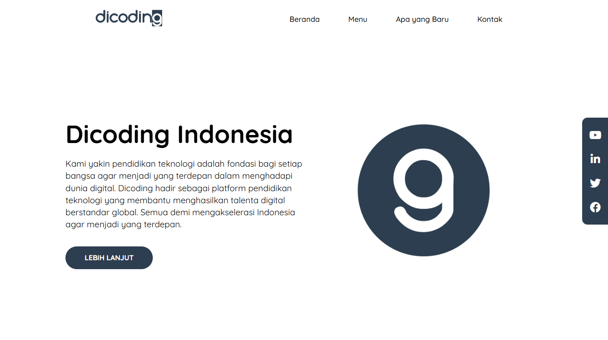

# 🚀 Landing Page Website - Dicoding IDCamp Project

Selamat datang di repository proyek **Landing Page Website** yang saya buat sebagai bagian dari latihan di program **IDCamp** dari Dicoding.

---

## 📷 Snapshot

---

## 📝 Deskripsi Proyek

Saya membuat sebuah **Landing Page sederhana** yang berfungsi sebagai halaman depan dari website **Dicoding**.  
Proyek ini saya buat dalam rangka meningkatkan **skill dasar pemrograman web** yang saya pelajari saat mengikuti program **IDCamp**.

---

## 🔧 Teknologi yang Digunakan

- **HTML5**  
  Untuk membangun struktur halaman.
  
- **CSS3**  
  Untuk mempercantik tampilan dan layout halaman.

- **CSS Responsiveness**  
  Menggunakan teknik **media query** untuk membuat tampilan halaman agar tetap nyaman di berbagai perangkat (mobile, tablet, desktop).

---

## 💡 Fitur Landing Page

- Desain sederhana dan bersih.
- Layout responsif (Mobile-First Design).
- Navigasi halaman yang mudah dipahami.
- Konten informatif yang relevan.

---